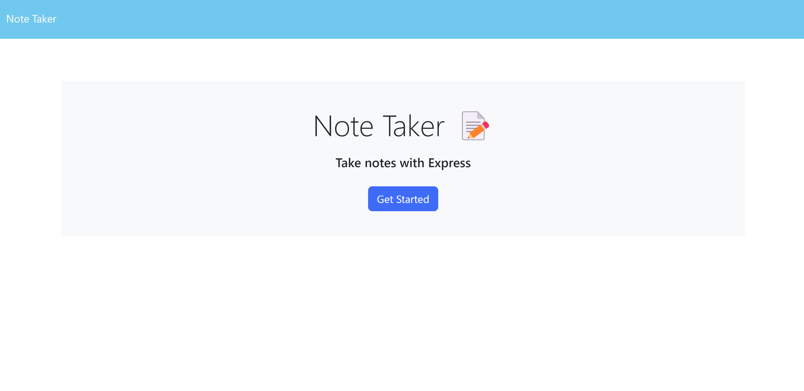
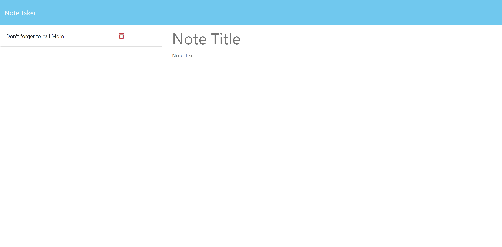

# Express Note Taker

Licensing: [mit](https://choosealicense.com/licenses/mit/)

## Table of Contents

- [Description](#description)
- [Installation](#installation-requirements)
- [Usage](#application-usage)
- [License](#licensing-information)
- [Contributions](#contributions)
- [Tests](#tests-commands)
- [Video Link](#link-to-video-instructions)
- [Screenshot](#screenshot)
- [Questions](#questions)

## Description

Note Taking application utilizing express servers.

## Installation Requirements

npm i express@4.16.4

npm i uuid@3.4.0

npm i -g nodemon

## Application Usage

Utilize the note taking application to write and save notes so you can keep track of tasks!

## Contributions

Eric Keeton

## Test Commands

nodemon server.js

## Link to Video Instructions

https://docs.google.com/document/d/1KubNfEWErAFVXc4BnuuXFo73zfFTgK532g4JLTN4uws/edit

## Screenshot

## Questions

For Questions, contact me at emk2473@gmail.com or visit My Github: [emk2473](https://github.com/emk2473)
